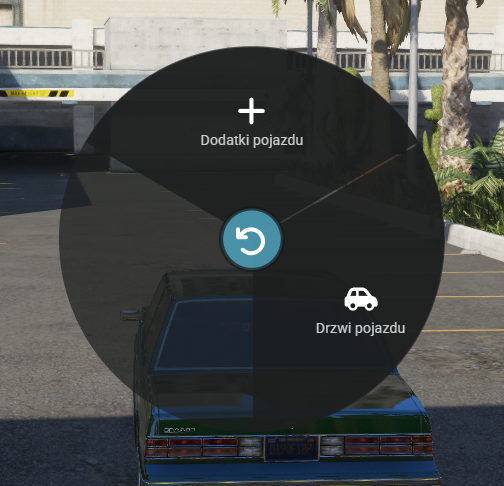

# Auta


<mark style="color:red;">**WAŻNE!**</mark> Każdy gracz na start otrzymuje auto. Znajduje się ono w garażu.


Po wejściu do auta pod F1(menu kołowe) pojawią się dwie dodatkowe opcje.

<figure><figcaption></figcaption></figure>

<mark style="color:green;">**Zacznijmy od podstaw.**</mark> \
Żeby odpalić auto należy użyj opcji **STACYJKA.** W ten sposób włożysz kluczyk do stacyjki. W ten sam sposób wyjmiesz ten kluczyk jeżeli był on w stacyjce.\
Następnie przejdźmy do opcji **POJAZD**

<figure><figcaption></figcaption></figure>

Ta opcja pozwala w prostu sposób operować dodatkami pojazdu jeżeli takowe posiada oraz w prostu i intuicyjny sposób te menu pozwala nam otwierać każde dostępne drzwi w samochodzie.

<figure><figcaption></figcaption></figure>


<mark style="color:purple;">**Pamiętaj!**</mark> Drzwi również idzie otwierać po przez interakcje naszej postaci z pojazdem. Otwieranie drzwi korzystając z menu kołowego powinno być odegrane.

