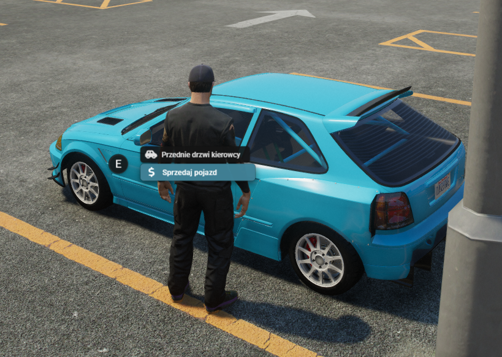
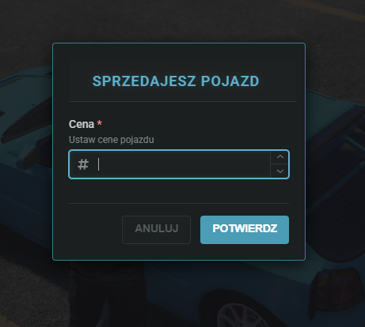

# Sprzedaż aut

Każde auto którego jesteś właścicielem możesz sprzedać innemu graczowi. W tym celu udaj się na giełdę pojazdów.

Należy zaparkować pojazd w miejscu giełdy. Następnie podejść do auta którego jesteś właścicielem i wybrać opcje "Sprzedaż pojazdu"

<figure><figcaption></figcaption></figure>

Nastepnie należy podać kwote jaka nas interesuje za auto.&#x20;

<figure><figcaption></figcaption></figure>

Po potwierdzeniu kwoty auto zostaje wystawione na rynek. \
Każdy gracz może podjechać i kupić owe auto.

<figure><figcaption></figcaption></figure>


<mark style="color:purple;">**PAMIĘTAJ!**</mark> W każdej chwili możesz anulować sprzedaż tym samym kluczyki wrócą do Ciebie i będziesz mógł tym pojazdem odjechać.

