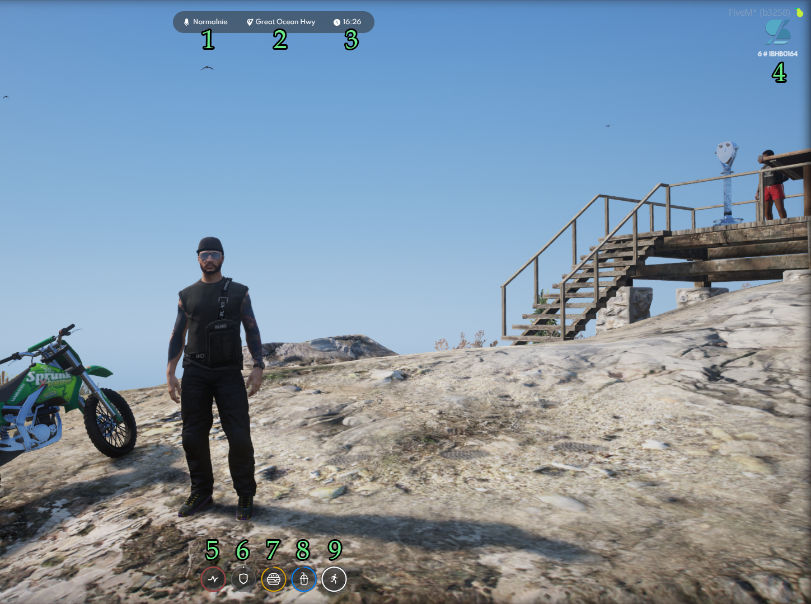

# Elementy interfejsu - HUD

<figure><figcaption></figcaption></figure>



* **Numer 1**\
  Określa siłę Twojego głosu a dokładnie głośność z jaką się porozumiewasz z innymi. W prosty sposób możesz wpływać na to czy chcesz mówić szeptem/normalnie czy krzykiem. Wystarczy że nadusisz <mark style="color:red;">**F5**</mark> a zaczniesz zmieniać siłę swojego głosu.
* **Numer 2**\
  Lokalizacja w której aktualnie się znajdujesz.
* Numer 3\
  Godzina w grze(na serwerze, nie myl z godziną w realnym życiu)
* **Numer 4**\
  Pierwszy numer czyli wszystko przed znakiem **#** oznacza **Twój numer ID** następnie cały ciąg znaków po znaku # oznacza Twój citizen ID.&#x20;


<mark style="color:purple;">**PAMIĘTAJ!**</mark> Twój numer ID zmienia się za każdym razem gdy wejdziesz i wyjdziesz na serwer natomiast Twój citizen ID jest stały, przypisany do danej postaci.




* **Numer 5**\
  Wskaźnik ten oznacza poziom zdrowia Twojej postaci.


<mark style="color:purple;">**PAMIĘTAJ!**</mark> Jeżeli Twój stan zdrowia znacząco spadnie możesz zacząć odczuwać zawroty głowy lub nawet zemdleć!


* **Numer 6**\
  Wskaźnik ten oznacza poziom dodatkowej ochrony. W skład dodatkowej ochrony wliczają się różnego rodzaju kamizelki czy hełmy kuloodporne.
* **Numer 7**\
  Wskaźnik ten pokazuje poziom nasycenia Twojej postaci.


<mark style="color:purple;">**PAMIĘTAJ!**</mark> Lepsze jedzenie szybciej będzie uzupełniało poziom nasycenia Twojej postaci.


* **Numer 8**\
  Wskaźnik ten pokazuje poziom nawodnienia Twojej postaci.


<mark style="color:purple;">**PAMIĘTAJ!**</mark> Lepsze napoje pozwolą Ci szybciej uzupełnić poziom nawodnienia Twojej postaci.


* **Numer 9**\
  Wskaźnik ten pokazuje poziom energii Twojej postaci. Poziom tego wskaźnika będzie określał jak długo będziesz mógł biec.


<mark style="color:purple;">**PAMIĘTAJ!**</mark>**&#x20;Istnieją środki dzięki którym będziesz miał więcej energii.**

