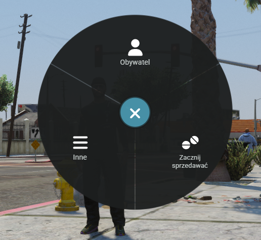

# Koło wyboru - F1

**Jedno z podstawowych miejsc w które będziesz zaglądać. Czyli menu(koło wyboru) pod&#x20;**<mark style="color:red;">**F1.**</mark>

<figure><figcaption></figcaption></figure>

Dzięki tej opcji będziesz mógł w łatwy sposób tworzyć dokumenty/umowy, sprawdzać dokładnie stan swojego zdrowia, wkładać bądź zabierać kluczyki ze stacyjki bądź też otwierać lub zamykać drzwi w aucie.&#x20;


<mark style="color:red;">**UWAGA!**</mark> Niektóre opcje, pokazują się dopiero kiedy zaczniesz korzystać z danych mechanik.\
Przykład, opcje auta pojawią się dopiero po wejściu do auta.

