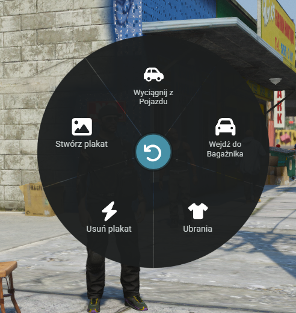

# Opcja - INNE

<figure><figcaption></figcaption></figure>

Myślę że większość z tych opcji jest czytelne i nie trzeba uch tłumaczyć dlatego skupimy się na dwóch najważniejszych.

1. **Stwórz plakat**\
   Dzięki tej opcji możesz w dowolnych miejscach w Los Angeles rozwiesić swój plakat wcześniej przygotowany w programie graficznym bądź ten w edytorze dostępnym na serwerze.
2. **Usuń plakat**\
   Podchodząc do plakatu, używając tego przycisku zerwiesz dany plakat bez powrotnie.\
