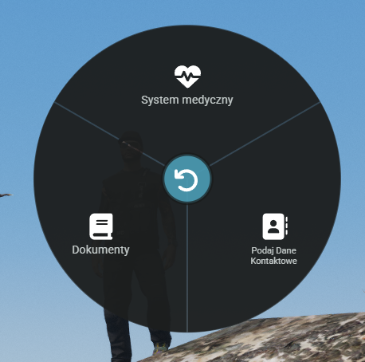

# Opcja - OBYWATEL

<figure><figcaption></figcaption></figure>

1. **System medyczny**\
   W prosty sposób możesz sprawdzić czy Twoja postać nie ma problemów zdrowotnych takich jak rany, za wysoki lub za niski puls czy ciśnienie. Zobaczysz tutaj też również czy Twoja postać nie doznała jakiś złamań.
2. **Dokumenty**\
   Dzięki tej opcji możesz stworzyć dokumenty sprzedaży czy też umowy miedzy Twoja postacią a innymi bądź miedzy firmami. Dzięki tej opcji możecie zawierać umowy nie tylko "na słowo" ale również w wersji papierowej.
3. **Podaj dane kontaktowe**\
   Jeżeli znajdujesz się blisko gracza, jest to szybki sposób podania mu numeru telefonu.&#x20;
