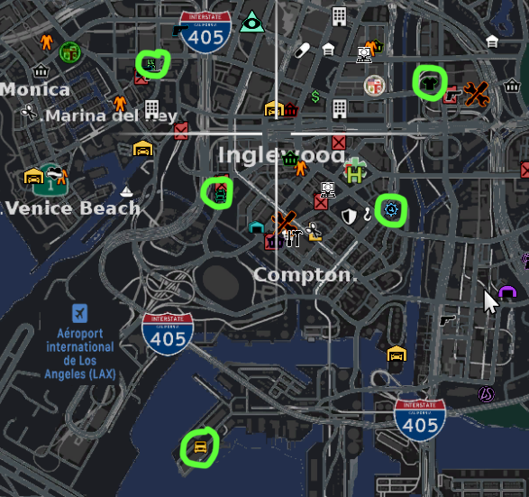
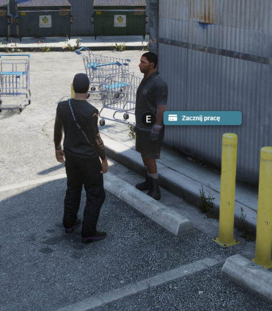
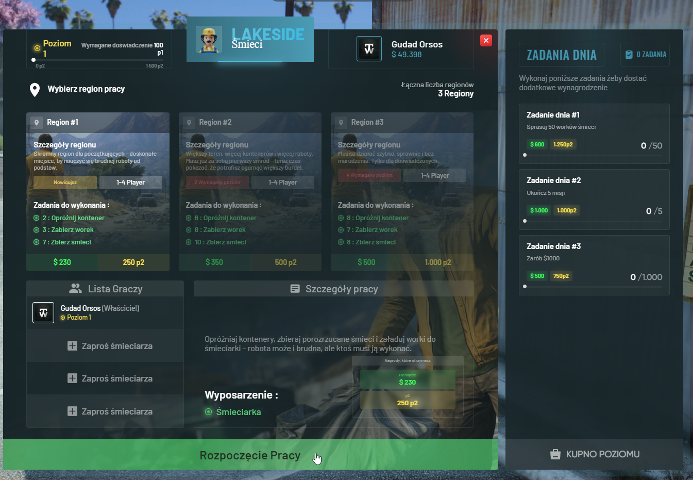
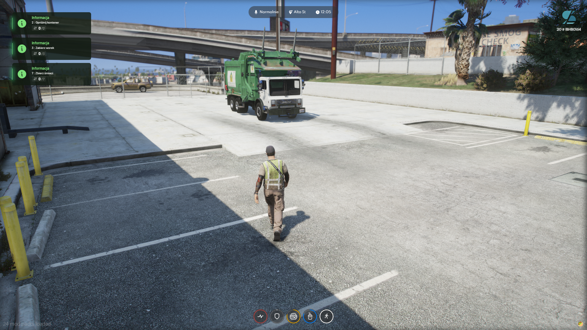

# Praca


<mark style="color:red;">**WAŻNE!!**</mark> Na serwerze mamy 5 prac legalnych ale nie są to jedyne źródła zarobku!


<figure><figcaption></figcaption></figure>

Każda z prac wyróżnia się sposobem jej wykonywania jednak samo podjęcie pracy jest analogiczne w każdych z wyżej zaznaczonych map. Poniżej krótki poradnik w jaki sposób można podjąć prace:\
\

* [x] Udaj się w wybrane miejsce

<figure><figcaption></figcaption></figure>

* [x] Zacznij rozmowę ze zleceniodawcą

<figure><figcaption></figcaption></figure>

* [x] Wybierz odpowiednie zlecenie i je rozpocznij

<figure><figcaption></figcaption></figure>

Po wykonanych zleceniach które widać w lewym górnym narożniku, zakończysz zlecenie, dostaniesz wynagrodzenie oraz punkty doświadczenia.&#x20;


<mark style="color:purple;">**PAMIĘTAJ!**</mark> Każde kolejne zlecenie wykonane w danym zawodzie to kolejne punkty doświadczenia. Większy poziom doświadczenia odblokowuję bardziej dochodowe zlecenia.

